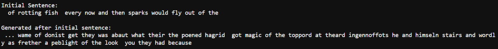

# Text-Generation using LSTM

## Dataset:
HARRY POTTER AND THE GOBLET OF FIRE
https://github.com/shahryarfp/LSTM-Text-Generation/blob/main/dataset.txt

## How to use:
1. Open the .py file
2. Correct the link to the dataset
3. Run the code

## Result:
After 60 epochs the result was not satisfactory at all :)

sample result:

